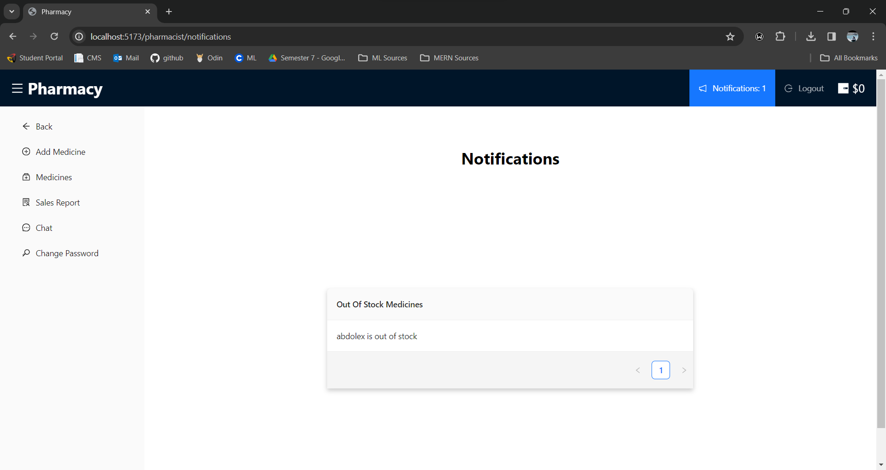

## About the Project

Welcome to the Pharmacy Website project! This web application is designed to provide patients with a convenient platform to purchase medicines, monitor their orders, engage in live chat with pharmacists, and obtain prescription-based medications uploaded from our affiliated website, V-Clinic. Pharmacists can register online, manage their profiles, and add medicines available for patients to purchase.

---

## Motivation

This pharmacy website project is driven by the ambition to redefine healthcare accessibility and convenience. By creating a digital platform that enables patients to effortlessly purchase medicines, track orders, and engage with pharmacists in real-time, we aim to bridge gaps in healthcare services. Our motivation is to enhance the patient experience by simplifying the process of obtaining prescribed medications through seamless integration with V-Clinic, while fostering collaboration between patients and pharmacists. Ultimately, our goal is to empower individuals, promote informed decision-making, and contribute positively to their health and well-being, revolutionizing the pharmacy experience through technology-driven solutions.

---

## Build Status

- The project is currently in active development.
- **Deployment Plan:** Scheduled deployment through AWS Services or similar platforms in the near future.
- **Initiating End-to-End Testing:** Commencing efforts to enhance End-to-End (E2E) tests, aiming for more comprehensive coverage.
- **Current Build Update:** The latest build of the project has undergone meticulous review and improvements.

Sprint 3 evaluation and feedback sessions helped in correcting minor tweaks. The system now stands refined, addressing reviews, progress updates, and discounts. Additionally, the system boasts several advanced features beyond the core functionalities.

---

## Code Quality and Style Enforcement

**ESLint (Backend & Frontend):** Employed for enforcing clean, optimal, and consistent code practices in both backend and frontend development. ESLint is configured to define and enforce rules ensuring a unified code style among team members.

**Prettier:** Functions as an automated code formatter that runs before each commit, maintaining consistent and visually appealing code across the entire project. It ensures standardized code formatting for enhanced readability and consistency.

These tools, ESLint for code rule enforcement and Prettier for code formatting, collectively help maintain a high level of code quality, readability, and consistency within the project.

---

## Tech/Framework Used

The project is constructed on the MERN stack, leveraging a set of core technologies:

- **MongoDB:** This NoSQL database stores data in a flexible, JSON-like format, ensuring efficient and scalable data management.
- **Express.js:** Utilized as the backend web application framework, Express.js aids in creating robust APIs and web applications, providing a seamless connection between the frontend and database.
- **React:** As a versatile JavaScript library, React facilitates the creation of dynamic and interactive user interfaces, enhancing the user experience.
- **Node.js:** Serving as the JavaScript runtime environment for server-side scripting, Node.js enables the development of scalable applications.

In addition to the core stack, the project incorporates several essential APIs:

- **JWT (JSON Web Tokens):** Used for secure authentication and authorization, JWT plays a pivotal role in ensuring data security and user access control.
- **Socket.IO:** Enabling real-time communication, Socket.IO enhances the platform with live chat functionality, fostering immediate interaction between users and pharmacists.
- **Stripe:** Integrated for seamless and secure payment processing, Stripe ensures a smooth transaction experience for purchasing medicines.
- **Multer:** Employed for handling file uploads, Multer simplifies the process of uploading prescription files, enhancing the prescription-based medication purchase feature.
- **Joi:** Utilized for data validation, Joi aids in validating and ensuring the integrity of user inputs, contributing to a robust and secure system.
- **Nodemailer:** Integrated for email functionality, Nodemailer facilitates the sending of notifications and updates to users, enhancing communication within the platform.

These technologies and APIs collectively form the foundation of the project, enabling a comprehensive full-stack JavaScript-based development approach. Understanding and familiarity with these technologies are crucial for comprehending, contributing to, and further enhancing the project.

---

## Screenshots

- #### Sign in using username and password.


- #### Viewing Medicines.


- #### Viewing cart.


- #### Viewing prescriptions.


- #### Viewing orders.


- #### Chatting with a pharmacist.


- #### Adding a new medicine as a pharmacist.


- #### getting notifications for out of stock medicines.



- #### Viewing monthly sales as a pharmacist.


- #### Adding another Admin as an Admin.


- #### Viewing All Patients on the System as an Admin.


- #### Viewing All Pharmacists on the System as an Admin.


---

## Features

- **Medicine Purchase:** Patients can browse through a wide range of medicines listed on the website and purchase them seamlessly.

- **Order Tracking:** The platform enables users to monitor their order status and receive real-time updates on the delivery process.

- **Live Chat with Pharmacists:** Patients have the option to engage in live chat sessions with registered pharmacists to seek guidance or ask queries about medications.

- **Prescription-Based Medicine Purchase:** Integration with V-Clinic allows patients to upload prescriptions directly, enabling them to purchase prescribed medications hassle-free.

- **Pharmacist Registration and Medicine Management:** Pharmacists can create profiles on the platform, adding and managing medicines available for purchase.

---

## Code Examples

- **Displaying Notifications in the frontend:**

```javascript
const Notification = () => {
  const [medicine, setMedicine] = useState(null);
  const socketRef = useRef(null);

  useEffect(() => {
    if (socketRef.current) {
      socketRef.current.disconnect();
    }

    socketRef.current = io("http://localhost:8900");

    const handleOutOfStockNotification = (receivedMedicine) => {
      console.log(receivedMedicine);
      receivedMedicine.medicineNames.forEach((medicine) => {
        medicine.name += " is out of stock";
      });
      setMedicine(receivedMedicine);
    };

    socketRef.current.on(
      "outOfStockNotification",
      handleOutOfStockNotification
    );

    return () => {
      if (socketRef.current) {
        socketRef.current.off(
          "outOfStockNotification",
          handleOutOfStockNotification
        );
        socketRef.current.disconnect();
      }
    };
  }, [socketRef]);

  const columns = [
    {
      title: "Out Of Stock Medicines",
      dataIndex: "name",
      key: "name",
    },
  ];

  return (
    <>
      <h1
        style={{
          marginTop: "70px",
        }}
      >
        Notifications
      </h1>
      {medicine ? (
        <Table
          dataSource={medicine.medicineNames}
          columns={columns}
          style={{
            width: "50%",
            marginTop: "180px",
            marginBottom: "auto",
            marginLeft: "auto",
            marginRight: "auto",
            boxShadow: "0 4px 8px 0 rgba(0,0,0,0.2)",
            backgroundColor: "#f5f5f5",
          }}
        />
      ) : (
        <Spinner />
      )}
    </>
  );
};

export default Notification;
```

- **Adding an Item to the cart in the Backend:**

```javascript
const addToCart = async (req, res) => {
  const patientId = req.user._id;
  const { medicine_id, quantity } = req.body;

  try {
    let cart = await Cart.findOne({ patient_id: patientId });

    if (!cart) {
      cart = new Cart({ patient_id: patientId, items: [] });
    }

    const existingItem = cart.items.find(
      (item) => item.medicine_id.toString() === medicine_id
    );

    if (existingItem) {
      existingItem.quantity += quantity;
    } else {
      cart.items.push({ medicine_id: medicine_id, quantity: quantity });
    }

    await cart.save();

    res.status(200).json({ message: "Item added to the cart" });
  } catch (error) {
    res.status(500).json({ message: error.message });
  }
};
```

---

## Installation

To run the project locally, follow these steps:

- **Clone this repository.**

```bash
git clone <repository_url>
```

- **Navigate to the project directory.**

```bash
cd balabizo-pharmacy
```

- **Navigate to the api directory, install dependencies and start the server**

```bash
cd api
npm install
npm start
```

- **Navigate to the client directory, install dependencies and start the client**

```bash
cd client
npm install
npm run dev
```

- **Navigate to the socket directory, install dependencies and start the socket server**

```bash
cd socket
npm install
npm start
```

---

## API Reference

### Admin Routes

#### Log in as an admin user

```http
POST /admin/login
Content-Type: application/json
```

| Body     | Type   | Description      |
| -------- | ------ | ---------------- |
| email    | string | Admin's email    |
| password | string | Admin's password |

#### Create a new admin user

```http
POST /admin
Content-Type: application/json
```

| Body     | Type   | Description      |
| -------- | ------ | ---------------- |
| name     | string | Admin's name     |
| email    | string | Admin's email    |
| password | string | Admin's password |

#### Update approval status of a specific admin

```http
PATCH /admin/:id
```

| Parameter | Type   | Description          |
| --------- | ------ | -------------------- |
| id        | string | ID of the admin user |

### Authentication Routes

#### Request a password reset

```http
POST /auth/reset-password
Content-Type: application/json
```

| Body  | Type   | Description  |
| ----- | ------ | ------------ |
| email | string | User's email |

#### Change the password after a reset

```http
POST /auth/change-password/:id/:token
```

| Parameter | Type   | Description |
| --------- | ------ | ----------- |
| id        | string | User ID     |
| token     | string | Reset token |

#### Get information about the currently logged-in user

```http
GET /auth/me
```

#### Change the password of the currently logged-in user

```http
POST /auth/change-password
Content-Type: application/json
```

| Body            | Type   | Description      |
| --------------- | ------ | ---------------- |
| currentPassword | string | Current password |
| newPassword     | string | New password     |

#### Log out the currently logged-in user

```http
POST /auth/logout
```

### Cart Routes

#### Add a medicine to the cart

```http
POST /cart
Content-Type: application/json
```

| Body        | Type   | Description          |
| ----------- | ------ | -------------------- |
| medicine_id | string | ID of the medicine   |
| quantity    | number | Quantity of medicine |

#### Retrieve the items in the cart

```http
GET /cart
```

#### Remove a medicine from the cart

```http
DELETE /cart/:medicine_id
```

| Parameter   | Type   | Description        |
| ----------- | ------ | ------------------ |
| medicine_id | string | ID of the medicine |

#### Update the quantity of a medicine in the cart

```http
PATCH /cart
Content-Type: application/json
```

| Body        | Type   | Description        |
| ----------- | ------ | ------------------ |
| medicine_id | string | ID of the medicine |
| quantity    | number | New quantity       |

### Chat Routes

#### Start a new chat

```http
POST /chat
Content-Type: application/json
```

| Body        | Type   | Description               |
| ----------- | ------ | ------------------------- |
| userId      | string | ID of the initiating user |
| recipientId | string | ID of the recipient user  |

#### Retrieve all chats for a user

```http
GET /chat/:userId
```

| Parameter | Type   | Description    |
| --------- | ------ | -------------- |
| userId    | string | ID of the user |

#### Send a new message

```http
POST /chat/messages
Content-Type: application/json
```

| Body           | Type   | Description                        |
| -------------- | ------ | ---------------------------------- |
| conversationId | string | ID of the conversation             |
| senderId       | string | ID of the user sending the message |
| text           | string | Text of the message                |

#### Retrieve all messages for a conversation

```http
GET /chat/messages/:conversationId
```

| Parameter      | Type   | Description            |
| -------------- | ------ | ---------------------- |
| conversationId | string | ID of the conversation |

#### Retrieve contacts for a patient

```http
GET /chat/patient-contacts/:userId
```

| Parameter | Type   | Description            |
| --------- | ------ | ---------------------- |
| userId    | string | ID of the patient user |

#### Retrieve contacts for a pharmacist

```http
GET /chat/pharmacist-contacts/:userId
```

| Parameter | Type   | Description               |
| --------- | ------ | ------------------------- |
| userId    | string | ID of the pharmacist user |

### Medicine Routes

#### Get all medicines

```http
GET /medicine
```

#### Create a new medicine

```http
POST /medicine
Content-Type: application/json
```

| Body        | Type   | Description                 |
| ----------- | ------ | --------------------------- |
| name        | string | Name of the medicine        |
| description | string | Description of the medicine |
| price       | number | Price of the medicine       |
| image       | string | Path to the medicine image  |
| ...         | ...    | Add other necessary fields  |

#### Get details of a specific medicine

```http
GET /medicine/:id
```

| Parameter | Type   | Description        |
| --------- | ------ | ------------------ |
| id        | string | ID of the medicine |

#### Update details of a specific medicine

```http
PATCH /medicine/:id
Content-Type: application/json
```

| Parameter | Type   | Description        |
| --------- | ------ | ------------------ |
| id        | string | ID of the medicine |

#### Archive a specific medicine

```http
PATCH /medicine/archive/:id
```

| Parameter | Type   | Description        |
| --------- | ------ | ------------------ |
| id        | string | ID of the medicine |

#### Unarchive a specific medicine

```http
PATCH /medicine/unarchive/:id
```

| Parameter | Type   | Description        |
| --------- | ------ | ------------------ |
| id        | string | ID of the medicine |

### Order Routes

#### Create a new order

```http
POST /order
Content-Type: application/json
```

| Body  | Type   | Description                    |
| ----- | ------ | ------------------------------ |
| items | array  | Array of medicine and quantity |
| total | number | Total cost of the order        |
| ...   | ...    | Add other necessary fields     |

#### Create a new order using credit card payment

```http
POST /order/cc
Authorization: Bearer YOUR_ACCESS_TOKEN
Content-Type: application/json
```

| Body         | Type   | Description                    |
| ------------ | ------ | ------------------------------ |
| items        | array  | Array of medicine and quantity |
| total        | number | Total cost of the order        |
| paymentToken | string | Payment token for credit card  |
| ...          | ...    | Add other necessary fields     |

#### Get orders for the current user

```http
GET /order/me
```

#### Cancel a specific order

```http
PATCH /order/:id
```

| Parameter | Type   | Description     |
| --------- | ------ | --------------- |
| id        | string | ID of the order |

### Patient Routes

####

Create a new patient

```http
POST /patient
Content-Type: application/json
```

| Body     | Type   | Description                |
| -------- | ------ | -------------------------- |
| name     | string | Patient's name             |
| email    | string | Patient's email            |
| password | string | Patient's password         |
| ...      | ...    | Add other necessary fields |

#### Log in as a patient

```http
POST /patient/login
Content-Type: application/json
```

| Body     | Type   | Description        |
| -------- | ------ | ------------------ |
| email    | string | Patient's email    |
| password | string | Patient's password |

#### Get all patients

```http
GET /patient
```

#### Delete a specific patient

```http
DELETE /patient/:id
```

| Parameter | Type   | Description       |
| --------- | ------ | ----------------- |
| id        | string | ID of the patient |

#### Get details of a specific patient

```http
GET /patient/:id
```

| Parameter | Type   | Description       |
| --------- | ------ | ----------------- |
| id        | string | ID of the patient |

#### Get delivery addresses for the patient

```http
GET /patient/delivery/delivery-address
```

#### Add a delivery address for the patient

```http
POST /patient/delivery/delivery-address
Content-Type: application/json
```

| Body    | Type   | Description                |
| ------- | ------ | -------------------------- |
| address | string | Patient's delivery address |

#### Choose a default delivery address for the patient

```http
PATCH /patient/delivery/delivery-address
Content-Type: application/json
```

| Body      | Type   | Description              |
| --------- | ------ | ------------------------ |
| addressId | string | ID of the chosen address |

### Pharmacist Routes

#### Log in as a pharmacist

```http
POST /pharmacist/login
Content-Type: application/json
```

| Body     | Type   | Description           |
| -------- | ------ | --------------------- |
| email    | string | Pharmacist's email    |
| password | string | Pharmacist's password |

#### Create a new pharmacist

```http
POST /pharmacist
Content-Type: multipart/form-data
```

| Body      | Type   | Description                |
| --------- | ------ | -------------------------- |
| name      | string | Pharmacist's name          |
| email     | string | Pharmacist's email         |
| password  | string | Pharmacist's password      |
| license   | string | Pharmacist's license       |
| documents | file[] | Array of document files    |
| ...       | ...    | Add other necessary fields |

#### Get all pharmacists

```http
GET /pharmacist
```

#### Delete a specific pharmacist

```http
DELETE /pharmacist/:id
```

| Parameter | Type   | Description          |
| --------- | ------ | -------------------- |
| id        | string | ID of the pharmacist |

#### Get details of a specific pharmacist

```http
GET /pharmacist/:id
```

| Parameter | Type   | Description          |
| --------- | ------ | -------------------- |
| id        | string | ID of the pharmacist |

#### Update approval status of a specific pharmacist

```http
PATCH /pharmacist/:id
```

| Parameter | Type   | Description          |
| --------- | ------ | -------------------- |
| id        | string | ID of the pharmacist |

### Prescriptions Routes

#### Get all prescriptions for the authenticated user

```http
GET /prescription
```

---

## Tests

**Testing Process Used with Postman**

During the development phase of this project, I conducted various tests using Postman to ensure functionality and reliability.

- **Endpoint Validation:**

Employed Postman to test each API endpoint individually, verifying their functionalities by sending distinct requests (GET, POST, PUT, DELETE, etc.) to specific routes.

Checked the response data against expected outcomes, ensuring proper functionality.

- **Authentication and Authorization:**

Tested the authentication mechanism, validating correct authentication and handling of invalid credentials.

Ensured proper authorization by attempting access to restricted routes and verifying the response for unauthorized access.

- **Data Integrity and Error Handling:**

Conducted tests with different sets of data to validate input validation and response integrity.

Simulated error scenarios by intentionally sending incorrect requests, ensuring the API provided accurate error messages and appropriate HTTP status codes.

- **Cross-Functional Testing:**

Tested the integration between different functionalities to ensure seamless operation across various parts of the system.

These tests allowed for thorough validation and verification of the project's functionalities during the development phase. They helped in identifying and rectifying issues, ensuring the robustness and reliability of the API endpoints.

---

## How to Use?

### For Pharmacists:

- **Sign Up and Profile Update:**

Navigate to the registration page and create an account by providing the necessary information.
Complete your profile by updating essential details and uploading required documents for verification purposes.

- **Verification and Approval:**

Upon submission of your profile and documents, our team will review and verify the provided information.
Once approved, you will receive a notification or email confirming your access to the platform.

- **Login and Access Website Features:**

Log in to your account using the provided credentials after verification.

Access the dashboard and utilize the full spectrum of website features, including adding medicines for purchase and engaging in live chat with patients.

### For Patients:

- **Sign Up:**

Visit the registration page and create an account by filling in the required details.

- **Login and Start Exploring:**

Log in to your account using the provided credentials.

Explore the various features available, such as browsing and purchasing medicines, tracking orders, and engaging in live chat with registered pharmacists for assistance or queries.

---

## Contribute

We encourage and value contributions from the community! If you're interested in contributing to this project feel free to reach out to us via email at yousseftamer1990@gmail.com. We look forward to collaborating with you!

Your contributions, whether it's in the form of code, suggestions, or bug fixes, are highly appreciated and vital to the project's growth and improvement.

---

## Credits

### Ant Design

We would like to extend our gratitude to Ant Design for providing a rich collection of UI components and design resources that significantly contributed to the user interface of this project. Their robust and customizable components have enhanced the visual appeal and functionality of our platform.

### Net Ninja and Web Dev Simplified

We express our appreciation to Net Ninja and Web Dev Simplified for their invaluable online tutorials and educational content. The insightful tutorials, explanations, and guidance from these platforms have been instrumental in shaping our understanding of various web development concepts, enabling us to build and improve this project effectively.

Their dedication to sharing knowledge and expertise has been an essential resource for our team throughout the development process.

---

## License

This project is licensed under both the MIT License and the Apache License 2.0.

---
